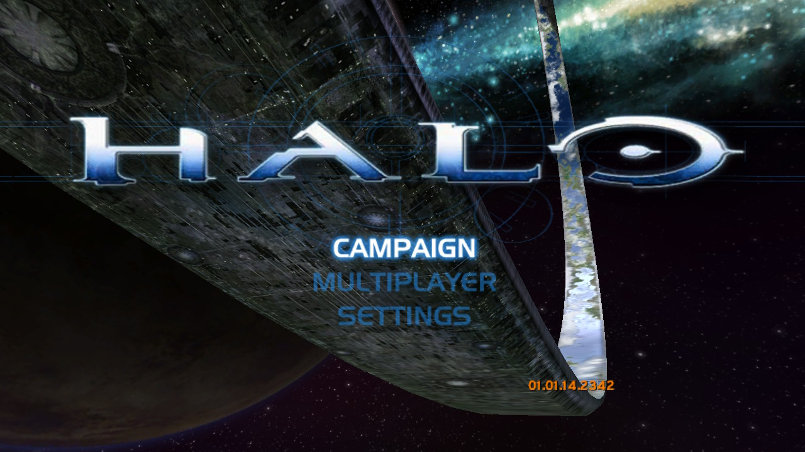
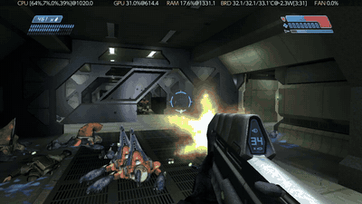

# Halo: Combat Evolved for Switch

A native Nintendo Switch port of **Halo: Combat Evolved**, built from the
Xbox decompilation. Not an emulator — the game's own code runs natively
on the Switch's CPU, and its Direct3D rendering is translated to OpenGL ES,
which runs on the Switch's GPU through Vulkan.

**Status: playable.** On real hardware it plays the intro movie from the
disc, boots to the main menu and plays the campaign with sound and controller
input. It holds **60 fps** walking and in light fighting, but **big battles
drop to 30–45 fps**: the game's simulation and the renderer share one CPU core
and the GPU is busy too, and that is the next thing being worked on.
Rendering goes through Vulkan (Zink over NVK), and compiled shaders are kept
on the SD card between sessions. Still rough in places; see
[Known issues](#known-issues) and [PORTING.md](PORTING.md).

**No game data is included.** You need your own Xbox copy of Halo:
Combat Evolved — the PC version's maps don't work.

## Screenshots



[](port/switch/media/gameplay.mp4)

*Captured on a Switch. The numbers along the top of the clip come from a
performance overlay running alongside, not from the game.*

## Installing

1. Copy `haloce-nx.nro` and `guest.elf` to `sdmc:/haloce-nx/`, the game's own
   folder.
2. Put your Xbox disc image there too, as `halo.xiso`. The first launch
   copies its maps, movies and `default.xbe` out of it (a few minutes),
   then restarts itself straight into the game. An already-extracted
   `maps/` folder, `bink/` folder and `default.xbe` work too.
3. Launch `sdmc:/haloce-nx/haloce-nx.nro` with full memory: make a
   [Sphaira](https://github.com/ITotalJustice/sphaira) forwarder for it (a
   home-menu icon), or open it from a game's title takeover (hold R while
   starting a game). Both run it as an application with the console's
   full memory; the homebrew menu opened from the album runs as an applet,
   with much less.

Saves, the map cache, `config.toml`, the shader cache and `debug.txt` (the
game's own log) go in `sdmc:/haloce-nx/`, and `host.log` beside the NRO.
Saves keep loading across updates: the game state sits at a fixed address
(saves made before October 6, 2026 builds don't load in later ones).

## Movies

The disc's Bink movies play as they are: the host decodes them with
FFmpeg, which reads Bink's pictures and sound, and hands them to the game
through the same Bink calls it always made. Five are used: `intro`,
`attract1`–`attract3` (the main menu, left idle) and `credits`, from
`sdmc:/haloce-nx/bink/`. They're 4:3, as on the Xbox. A `.mjx` transcode
(`tools/mjx_pack.py`, see [docs/mjx_movies.md](docs/mjx_movies.md)) beside
a `.bik` is played instead, if there is one.

## Building

Needs devkitPro (devkitA64 and libnx), Python 3 and Ninja. The game runs
as a 32-bit-pointer (ILP32) guest inside a normal 64-bit homebrew host,
so there are two builds:

```sh
# the guest: the game's objects, then a hand link
python3 configure.py
ninja switch_guest
python3 -c "import pathlib; objs=sorted(pathlib.Path('build/switch/obj').rglob('*.o')); open('/tmp/game_objs.txt','w').write(''.join('\"%s\"\n'%o for o in objs))"
aarch64-none-elf-gcc -mabi=ilp32 -nostdlib -ffreestanding -Wl,-T,port/switch/guest/guest.ld \
  @/tmp/game_objs.txt port/switch/guest/guest_main.o port/switch/guest/guest_text_demo.o \
  port/switch/guest/guest_syscall.o port/switch/guest/guest_tp.o \
  port/switch/guest/guest_softfloat_stubs.o port/switch/guest/guest_stdio_shim.o \
  port/switch/guest/guest_runtime_init.o port/switch/guest/guest_platform_stubs.o \
  port/switch/guest/guest_pthread_stubs.o port/switch/guest/guest_syscall_cp.o \
  port/switch/guest/build/musl/libc.a -o guest.elf -Wl,-e,__guest_entry

# the host: OpenGL ES through nxvk (Zink over the NVK Vulkan driver, Mesa 26)
make -C port/switch/host -j2
```

The host links [nxvk](https://github.com/nx-mod/nxvk)'s OpenGL ES, installed as a
devkitPro portlib, and devkitPro's `switch-ffmpeg` (Bink movies),
`switch-libjpeg-turbo` and `switch-libexpat`.
Mesa's shader disk cache keeps compiled shaders in
`sdmc:/haloce-nx/mesa_shader_cache/`, so a shader is compiled once, not every
session, and `sdmc:/haloce-nx/shader_programs.bin` records every program the game
has used. `make -C port/switch/host MESA20=1` builds the earlier host on devkitPro's
Mesa 20.1 instead (`haloce-nx-mesa20.nro`, no shader cache), for comparison.

`guest.elf` is not produced by Ninja; the link above is the only way to
make it (see PORTING.md). The guest runtime objects in `port/switch/guest/`
(`guest_main.o`, `guest_syscall.o`, `guest_platform_stubs.o`, ...) and its
musl are built separately, as PORTING.md describes: rebuild the one you
change before linking.

## Settings

The game writes `sdmc:/haloce-nx/config.toml` on its first launch, with
every setting at its default and a comment explaining it. Edit it with any
text editor; changes apply at the next launch. Your edits and comments are
kept, settings a newer version adds are appended, and a mistake is reported
in `debug.txt` with the default used instead. Delete the file to start over.

| setting | default | what it does |
|---|---|---|
| `display.interpolation` | `true` | draws frames between the game's 30 ticks a second, for smooth motion above 30 fps; `false` draws 30 |
| `display.frame_rate` | `60` | the cap: `60`, `30`, or `0` for none |
| `display.vsync` | `true` | waits for the display; `false` presents at once (tearing), sleeping to the cap if there is one |
| `display.fxaa` | `true` | smooths jagged edges (about 1 ms of GPU time) |
| `display.sharpen` | `0.4` | contrast-adaptive sharpening, `0.0` to `1.0` |
| `display.render_scale` | `1.0` | the resolution drawn, as a share of 720p: `0.75` is 960x540, down to `0.5`; lower helps where the GPU is the limit (big battles) |
| `display.gamma` | `1.0` | brightness of the darker parts: above `1.0` brighter, below darker |
| `display.shader_warmup` | `true` | compiles every shader the game has used before on the idle third core at start, so meeting one in play is not a stall |
| `display.anisotropy` | `4` | texture sharpness at a slant: `1` (original), `2`, `4`, `8`, `16` |
| `display.shadow_resolution` | `256` | the size objects' shadows are drawn at: `128` (the Xbox's, with stepped edges that crawl), `256`, `512`, `1024` |
| `display.lens_flares` | `true` | lens flares and the glow around lights |
| `display.lens_flare_test_every` | `2` | test each light's visibility every Nth frame: `1` is the original, higher is cheaper |
| `overlay.enabled` | `true` | the frame rate overlay |
| `overlay.position` | `"top"` | `"top"` or `"bottom"` |
| `overlay.frame_time` | `true` | the slowest frame of the last second, in ms — where a stutter shows |
| `overlay.shaders` | `true` | programs linked / compiled fresh: the second number is first-time stutter, and stays put once the shader cache is warm |
| `audio.enabled`, `audio.volume` | `true`, `1.0` | sound, and its volume from 0.0 to 1.0 |
| `game.language` | `""` | `"ja"`, `"de"`, `"fr"`, `"es"` or `"it"`; empty for English |
| `debug.gl_debug` | `false` | logs the GL driver's error messages (slower) |
| `debug.memory_watch_*` | | how often game memory is rechecked for changes the GPU needs; see the file's comments |
| `debug.environment` | `""` | `HALO_*` switches for testing, e.g. `"HALO_FRAME_TIMING=300 HALO_RENDER_PROFILE=1"` logs where each frame's time goes |

The overlay reads like `60 FPS  21 MS  212/3`: frames a second, the slowest
frame of the last second, and shader programs linked / compiled fresh.

## Known issues

- **Big battles run at 30–45 fps**, not 60. In a heavy fight a frame takes
  25–30 ms: 4–7 for the game's simulation (on the same core as the
  renderer), 4–6 for the models, 2–5 for the shadows, and the rest largely
  waiting on the GPU. Running the simulation on the idle third core is the
  first step being tried (`HALO_TICK_THREAD=1` in `debug.environment`,
  experimental).
- **A hitch the first time a shader is needed.** Compiled shaders are kept
  in `sdmc:/haloce-nx/mesa_shader_cache/`, and every program the game has
  used is compiled ahead on the idle third core at each start
  (`display.shader_warmup`), so a hitch is only ever met once; the
  overlay's last number counts them. A cache filled by one full
  playthrough could ship with a release so nobody meets any.
- The picture can look a little darker than expected (`display.gamma`
  brightens it); a model was seen to flash dark once, which interpolation's
  pose snapping may have fixed.
- Some letters in menu text sometimes show a thin box around them.

## Credits

- **Bungie** made Halo: Combat Evolved. Halo is a trademark of Microsoft.
- **[punpckhdq/halo](https://github.com/punpckhdq/halo)** /
  **[bnunu/halo-1](https://github.com/bnunu/halo-1)**: the decompilation
  this is built on, of Xbox build 2342 (`cachebeta.exe`).
- **[cybersecurity/halo-ce-universal](https://github.com/cybersecurity/halo-ce-universal)**:
  the Linux/Windows/Android port whose platform layer, renderer and
  netcode this tree carries (`port/linux`, `port/windows`, `port/android`).
  The Switch guest's libc (`port/switch/guest/libc`) adapts their
  Android guest's musl port for devkitA64's ILP32 ABI.
- **[musl](https://musl.libc.org)**: the guest's C library.
- **[BirchWoodGod/halo-ce-vita](https://github.com/BirchWoodGod/halo-ce-vita)**:
  the PS Vita port this repo is forked from.
- **[Xita](https://github.com/Xita-Project/xita)**: earlier Vita work
  (GPU translation, threading) that fed into the Vita port.
- **[Invader](https://github.com/SnowyMouse/invader)** by SnowyMouse:
  the tag definitions `tag_layouts.h` is generated from.
- **[nxvk](https://github.com/nx-mod/nxvk)**, from
  [PalindromicBreadLoaf/nxvk](https://github.com/PalindromicBreadLoaf/nxvk):
  [Mesa](https://mesa3d.org)'s NVK Vulkan driver and Zink on the Switch,
  which the host renders through.
- **[devkitPro](https://devkitpro.org)**, libnx, and its portlibs:
  FFmpeg, libjpeg-turbo, expat, and the toolchain.
- **[FFmpeg](https://ffmpeg.org)**: plays the Bink movies.
- **[tomlc17](https://github.com/cktan/tomlc17)**: the `config.toml` parser.

## License

GPLv3 ([LICENSE](LICENSE)) — `port/linux/src/tag_layouts.h` is generated
from Invader's GPL-3.0 tag definitions, and the host links NVK (GPL)
statically. The decompilation and
halo-ce-universal are CC0 ([LICENSES/CC0-1.0.txt](LICENSES/CC0-1.0.txt)).
Halo's maps, executable and other game content belong to their owners
and are not included.

Not affiliated with or endorsed by Microsoft or Bungie. Contains no game
assets.
